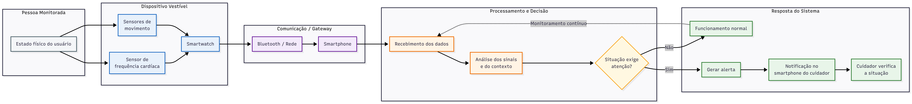

# Atividade em Grupo 01 : Análise Inicial de um Sistema Ubíquo

**Cenário escolhido:** Monitoramento ubíquo de saúde para pessoas idosas por meio de *smart clothing*.

---

## Parte 1 : Compreensão do problema

### 1. Problema e usuários

O sistema físico é implantado no ambiente em que a pessoa idosa reside. Além do idoso monitorado, profissionais de saúde e familiares com acesso ao sistema também são considerados usuários, atuando pela via digital (aplicativo/dispositivo móvel).

### 2. Contexto

É preciso que os sinais físicos do usuário sejam captados continuamente pelo sistema. O ambiente precisa ter conexão confiável e garantir o funcionamento dos sensores específicos, e o sistema deve oferecer feedback sobre seu funcionamento e o nível de bateria de suas partes.

### 3. Dispositivos e comunicação

Os dispositivos que compõem o sistema são uma **roupa inteligente** (captura dos sinais físicos), um **dispositivo móvel** e um **servidor remoto**.

- Roupa inteligente ↔ dispositivo móvel: **Bluetooth** (fallback: internet).
- Dispositivo móvel ↔ servidor: **internet**.

### 4. Processamento e resposta

As informações são processadas inicialmente **na borda** (no próprio dispositivo móvel) e, em seguida, distribuídas para o **servidor centralizado**, permitindo resposta mais rápida mesmo em caso de instabilidade de rede.

### 5. Risco principal

O maior risco identificado é a **rejeição da roupa inteligente** pelo idoso, ou **falhas na conexão do dispositivo móvel**, o que compromete a captação e o envio contínuo dos sinais monitorados.

---

## Parte 2 : Modelagem do sistema

### 6. Sensores, atuadores e gateway

- **Roupa inteligente (smart clothing):** integra os sensores responsáveis por captar os sinais físicos do idoso.
- **Dispositivo móvel:** atua como gateway entre a roupa inteligente e o servidor remoto, além de realizar o processamento de borda.
- **Servidor remoto:** centraliza os dados processados e permite o acesso de profissionais de saúde e familiares.

### 7. Fluxo do sistema

**Idoso → Roupa inteligente (sensores) → Bluetooth (fallback: internet) → Dispositivo móvel (borda/gateway) → Internet → Servidor centralizado → Profissionais de saúde/família**

### 8. Classificação

O sistema pode ser classificado como:

- **IoT:** a roupa inteligente coleta dados físicos e os envia a serviços digitais;
- **Aplicação ubíqua:** acompanha o idoso continuamente, com pouca necessidade de interação direta;
- **Rede de sensores:** utiliza sensores integrados à roupa para observar diferentes sinais do usuário.

### 9. Contexto e adaptação

Por se tratar de um sistema ubíquo, a mudança de contexto que pode modificar seu funcionamento é a alteração dos sinais vitais do idoso ou a detecção de erro em partes do sistema (mau funcionamento de sensores ou nível de bateria). Nesses casos, deve ser acionado um membro da família ou responsável com acesso ao ambiente para checar o paciente e os aparelhos.

---

## Conclusão

A proposta utiliza uma roupa inteligente para realizar o monitoramento contínuo dos sinais vitais de pessoas idosas, processando os dados na borda antes de distribuí-los ao servidor centralizado, e aciona familiares ou responsáveis sempre que uma alteração relevante nos sinais ou uma falha no sistema é detectada.
