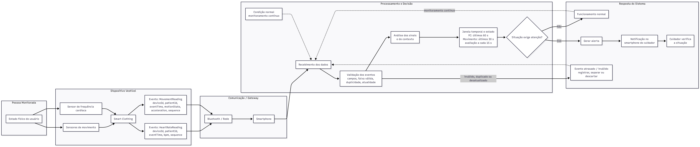

# Atividade em Grupo 02 : Processamento e Distribuição de Responsabilidades

**Integrantes:** Felipe Alves Leão de Araújo, Felipe O Carvalho, Matheus Augusto Ferreira Medeiros, Murilo Bernardo

**Cenário escolhido:** Monitoramento de sinais vitais de pessoas em situação de vulnerabilidade física por meio de *smart clothing*. Em relação à Atividade 01, o público foi ampliado (de pessoas idosas) e os sensores foram delimitados a frequência cardíaca e movimento, para tornar a regra de decisão verificável.

A roupa inteligente envia os dados por Bluetooth (BLE) ao smartphone da pessoa, que atua como gateway e nó de borda. O objetivo é **monitorar e alertar**, não diagnosticar.

---

## Parte 1 : Eventos do sistema

### 1. Tipos de evento

- **`HeartRateReading`** — uma medição de frequência cardíaca (sinal fisiológico).
- **`MovementReading`** — uma observação do estado de movimento (contexto que separa repouso de esforço).

São ocorrências diferentes: a FC diz *o que* está acontecendo, o movimento diz *em que situação*.

### 2. Contrato dos eventos

Nos dois eventos, o **produtor** é um sensor da *smart clothing* e a **entidade observada** é a pessoa monitorada. Campos comuns:

`eventType` · `eventId` (identificador único) · `deviceId` · `patientId` (pseudonimizado) · `eventTime` (tempo do evento) · `sequence` (número sequencial do dispositivo) · `signalQuality` (0 a 1)

| Evento | Campos próprios | Unidade |
|---|---|---|
| `HeartRateReading` | `heartRate` | `bpm` |
| `MovementReading` | `motionState` (`REST`/`ACTIVE`), `acceleration` | `g` |

### 3. Exemplos

```json
{ "eventType": "HeartRateReading", "eventId": "hr-0042-1842",
  "deviceId": "smart-clothing-01", "patientId": "patient-0042",
  "eventTime": "2026-08-28T19:14:32-03:00", "sequence": 1842,
  "heartRate": 108, "unit": "bpm", "signalQuality": 0.94 }
```

```json
{ "eventType": "MovementReading", "eventId": "mov-0042-9273",
  "deviceId": "smart-clothing-01", "patientId": "patient-0042",
  "eventTime": "2026-08-28T19:14:34-03:00", "sequence": 9273,
  "motionState": "REST", "acceleration": 1.01, "unit": "g", "signalQuality": 0.91 }
```

### 4. Qualidade

Cada evento é validado no smartphone antes de participar de uma decisão:

- **Inválido:** falta campo obrigatório, origem não reconhecida, unidade incorreta ou `signalQuality` abaixo do limite (0,5).
- **Duplicado:** `eventId` já processado. O `sequence` serve de verificação adicional — valor repetido indica chegada fora de ordem, salto indica perda de amostras.
- **Desatualizado:** `eventTime` anterior à watermark (item 7). Não gera alerta imediato, mas é preservado para o histórico.

---

## Parte 2 : Processamento temporal

### 5. Operações

**Coleta → validação → normalização → deduplicação → filtragem por qualidade → agrupamento por pessoa → janelas → agregação → detecção → alerta**

A normalização converte unidades e horários para uma base comum e deriva `motionState` a partir de `acceleration`. O agrupamento é por `patientId`. A agregação calcula a FC média e o movimento predominante da janela. A detecção aplica a regra do item 6 e, quando satisfeita, produz o alerta enviado ao cuidador.

### 6. Estado e janela

A regra usa uma **janela deslizante**:

- **FC:** últimos 60 s | **movimento:** últimos 30 s | **avaliação:** a cada 15 s.
- **Amostragem esperada:** 1 leitura por segundo em cada fluxo.
- **Estado no smartphone:** leituras válidas das duas janelas, `eventId`/`sequence` recentes, maior `eventTime` observado e `alerta_ativo`.

> Se a **FC média dos últimos 60 s** ultrapassar o limite configurado para a pessoa **e** as leituras recentes indicarem **repouso**, o sistema gera um alerta.

O limite de FC é configurável e não representa diagnóstico. A janela só é válida com **cobertura mínima de 70%** das amostras esperadas (42 de 60 na FC, 21 de 30 no movimento) — a cobertura mede quanto da janela chegou de fato, evitando que uma média calculada sobre poucas leituras dispare um alerta falso. Abaixo disso o estado é **dados insuficientes** e nenhum alerta é gerado.

### 7. Semântica temporal

A regra usa **tempo do evento (`eventTime`)**, não o tempo de processamento, porque o dado pode atrasar no BLE ou no smartphone — uma leitura antiga tratada como atual distorceria a janela e a ordem real dos fatos.

O smartphone mantém uma **watermark de 10 s**: `watermark = maior eventTime observado - 10 s`. Ela define por quanto tempo uma leitura atrasada ainda é aceita — antes desse limite, o trecho do tempo é considerado fechado e o evento vira tardio (item 8).

### 8. Eventos atrasados

Se o evento chegar depois de a janela já ter produzido resultado e for anterior à watermark, a política é **SEPARAR**: ele é marcado como tardio e enviado ao histórico na nuvem, sem disparar alerta retroativo. Assim uma leitura antiga não gera atuação fora de contexto, mas continua disponível para análise da qualidade do sensor.

### 9. Pseudocódigo

```text
JANELA_FC = 60 s   JANELA_MOV = 30 s   PASSO = 15 s
ATRASO_TOLERADO = 10 s   COBERTURA_MINIMA = 70%   QUALIDADE_MINIMA = 0,5

ESTADO (por pessoa): fc_validas, mov_validas, ids_processados,
                     ultima_sequencia, maior_event_time, alerta_ativo

AO RECEBER evento:
    se campo ausente OU origem desconhecida OU unidade incorreta
       OU evento.signalQuality < QUALIDADE_MINIMA:
        marcar INVALIDO e descartar

    se evento.eventId em ids_processados:
        marcar DUPLICADO e descartar

    comparar evento.sequence com ultima_sequencia
        -> registrar chegada fora de ordem ou perda de amostras

    watermark = maior_event_time - ATRASO_TOLERADO
    se evento.eventTime < watermark:
        marcar TARDIO e separar para o histórico

    guardar o evento na janela do seu tipo
    atualizar ids_processados, ultima_sequencia e maior_event_time
    remover do estado o que saiu das janelas

A CADA 15 s:
    fc_janela  = FC dos últimos 60 s        (por eventTime)
    mov_janela = movimento dos últimos 30 s (por eventTime)

    se cobertura(fc_janela) < 70% OU cobertura(mov_janela) < 70%:
        estado = DADOS_INSUFICIENTES
        não alertar          // alerta_ativo é preservado, para não realertar

    se media(fc_janela) > limite_da_pessoa E maioria(mov_janela) == REST:
        se alerta_ativo == falso:
            gerar ALERTA e enfileirar para a nuvem
            alerta_ativo = verdadeiro
    senão:
        alerta_ativo = falso  // condição deixou de valer: rearma o alerta
```

---

## Parte 3 : Distribuição e resiliência

### 10. Distribuição de responsabilidades

| Local | Responsabilidades |
|---|---|
| **Dispositivo — smart clothing** | Amostrar FC e movimento, filtrar o sinal e produzir eventos com `eventId`, `eventTime` e `sequence`. |
| **Borda — smartphone** | Receber por BLE, validar, deduplicar, manter janelas e estado, agregar, aplicar a regra, gerar o alerta e enfileirá-lo. |
| **Nuvem** | Receber alertas e resumos, manter histórico de longo prazo e notificar o cuidador. |

**Névoa: não utilizada.** Não há necessidade verificável de coordenar vários gateways próximos entre si.

### 11. Justificativas

**Manter janela, estado e regra no smartphone (borda)** — a decisão exige baixa latência e não pode depender da internet; o smartphone tem mais capacidade que a roupa e está próximo da fonte, evitando transmitir todo o fluxo bruto.

**Usar a nuvem para histórico e entrega ao cuidador** — armazenamento de longo prazo e acesso remoto exigem disponibilidade que a borda não oferece. Como o processamento imediato ocorre na borda, a nuvem recebe apenas dados já validados ou resumidos, reduzindo volume e exposição.

### 12. Comportamento diante de falhas

**Falha escolhida: internet indisponível no smartphone.**

O BLE continua funcionando, e o smartphone segue validando eventos, mantendo as janelas e aplicando a regra localmente. O que precisaria ir à nuvem fica em uma **fila local**, preservando `eventId`, `eventTime` e `sequence`; ao reconectar, a fila é reenviada em ordem e os identificadores evitam duplicação.

O serviço fica **degradado**: a detecção local continua, mas o cuidador pode não receber a notificação remota até a reconexão.

### 13. Diagrama da distribuição

Fluxo completo, do sinal da pessoa até a resposta do sistema:



Quanto ao local de execução (item 10): *Dispositivo Vestível* corresponde ao **dispositivo**; *Comunicação/Gateway* e *Processamento e Decisão* ocorrem na **borda** (smartphone); a *Resposta do Sistema* é entregue pela **nuvem** ao aplicativo do cuidador.

---

## Conclusão

A modelagem mantém a proposta da Atividade 01 e explicita como as leituras da *smart clothing* viram uma decisão temporal: a FC só é interpretada junto ao contexto de movimento e dentro de uma janela, o que reduz o peso de leituras isoladas. O smartphone concentra o que exige baixa latência e continuidade; a nuvem cuida do histórico e da comunicação remota. Eventos inválidos, duplicados e atrasados, além da queda de conexão, têm tratamento definido antes de qualquer implementação.

---

## Resumo para a apresentação

- **Regra:** FC média dos últimos 60 s acima do limite da pessoa **e** movimento em repouso nos últimos 30 s → alerta ao cuidador. Avaliada a cada 15 s, por tempo do evento, só com cobertura ≥ 70%.
- **Onde roda:** no smartphone (borda), por latência e independência da internet; a nuvem guarda histórico e notifica.
- **Falha:** sem internet, o BLE e a regra local continuam; alertas ficam em fila e são reenviados na reconexão — serviço degradado, não interrompido.
