# Atividade em Grupo 02 — Processamento e Distribuição de Responsabilidades

**Disciplina:** Software para Sistemas Ubíquos (INF0483) — UFG  
**Professor:** Prof. Dr. Otávio Calaça Xavier

**Integrantes do grupo:**
- Felipe Alves Leão de Araújo
- Marcello Ronald José da Silva
- Matheus Augusto Ferreira Medeiros
- Murilo Bernardo

**Cenário utilizado:** Monitoramento inteligente de sinais vitais para pessoas em situação de vulnerabilidade física por meio de *smart clothing*.

O sistema utiliza uma roupa inteligente com sensores de frequência cardíaca e movimento. A roupa envia os dados por Bluetooth Low Energy (BLE) ao smartphone da pessoa monitorada, que atua como gateway e nó de borda. O objetivo continua sendo **monitorar e alertar**, e não realizar diagnóstico médico.

---

## Parte 1 — Eventos do sistema

### 1. Tipos de evento

Foram definidos dois tipos de evento produzidos pela *smart clothing* e utilizados em conjunto para decidir se uma situação merece atenção:

1. **`HeartRateReading`** — representa uma nova medição de frequência cardíaca.
2. **`MovementReading`** — representa uma nova observação do estado de movimento da pessoa.

Os eventos são diferentes porque registram fenômenos distintos. A frequência cardíaca representa um sinal fisiológico, enquanto o movimento fornece o contexto necessário para interpretar esse sinal, principalmente para diferenciar repouso de atividade física.

### 2. Contrato dos eventos

#### Evento 1 — `HeartRateReading`

| Campo | Descrição |
|---|---|
| `eventType` | Tipo do evento: `HeartRateReading` |
| `eventId` | Identificador único do evento |
| `deviceId` | Identificador da *smart clothing* |
| `personId` | Identificador pseudonimizado da pessoa monitorada |
| `eventTime` | Instante em que a medição ocorreu |
| `sequence` | Número sequencial produzido pelo dispositivo |
| `heartRate` | Frequência cardíaca medida |
| `unit` | Unidade da frequência cardíaca: `bpm` |
| `signalQuality` | Indicador de qualidade da leitura entre 0 e 1 |

**Produtor:** sensor de frequência cardíaca integrado à *smart clothing*.  
**Entidade observada:** pessoa monitorada.

#### Evento 2 — `MovementReading`

| Campo | Descrição |
|---|---|
| `eventType` | Tipo do evento: `MovementReading` |
| `eventId` | Identificador único do evento |
| `deviceId` | Identificador da *smart clothing* |
| `personId` | Identificador pseudonimizado da pessoa monitorada |
| `eventTime` | Instante em que a observação ocorreu |
| `sequence` | Número sequencial produzido pelo dispositivo |
| `movementState` | Estado estimado: `REST` ou `ACTIVE` |
| `accelMagnitude` | Magnitude da aceleração medida |
| `unit` | Unidade da aceleração: `g` |
| `signalQuality` | Indicador de qualidade da leitura entre 0 e 1 |

**Produtor:** sensor de movimento/acelerômetro integrado à *smart clothing*.  
**Entidade observada:** pessoa monitorada.

### 3. Exemplos de eventos

#### Exemplo de `HeartRateReading`

```json
{
  "eventType": "HeartRateReading",
  "eventId": "hr-0042-1842",
  "deviceId": "smart-clothing-01",
  "personId": "person-0042",
  "eventTime": "2026-08-28T19:14:32-03:00",
  "sequence": 1842,
  "heartRate": 108,
  "unit": "bpm",
  "signalQuality": 0.94
}
```

#### Exemplo de `MovementReading`

```json
{
  "eventType": "MovementReading",
  "eventId": "mov-0042-9273",
  "deviceId": "smart-clothing-01",
  "personId": "person-0042",
  "eventTime": "2026-08-28T19:14:34-03:00",
  "sequence": 9273,
  "movementState": "REST",
  "accelMagnitude": 1.01,
  "unit": "g",
  "signalQuality": 0.91
}
```

### 4. Qualidade dos eventos

Antes de participar de uma decisão, cada evento é validado no smartphone.

Um evento será considerado **inválido** quando faltar algum campo obrigatório, a origem não for reconhecida, a unidade estiver incorreta ou `signalQuality` estiver abaixo do limite mínimo configurado para o sensor.

Um evento será considerado **duplicado** quando já tiver sido processado outro evento com o mesmo `eventId`. Como verificação adicional, o sistema também acompanha o `sequence` de cada tipo de evento e dispositivo.

Um evento será considerado **desatualizado para decisão em tempo real** quando seu `eventTime` for anterior ao limite temporal já consolidado pelo sistema. Esses eventos não serão usados para gerar um novo alerta imediato.

---

## Parte 2 — Processamento temporal

### 5. Operações

O caminho principal dos eventos é:

**Coleta → validação → deduplicação → filtragem por qualidade → agrupamento por pessoa → atualização das janelas → agregação → detecção da situação → alerta**

1. A *smart clothing* coleta frequência cardíaca e movimento.
2. Os eventos são enviados ao smartphone por BLE.
3. O smartphone valida o contrato, a origem, a qualidade e a identificação do evento.
4. Eventos duplicados ou inválidos são removidos do fluxo de decisão.
5. Os eventos válidos são agrupados por `personId`.
6. As leituras de frequência cardíaca alimentam a janela temporal de FC.
7. As leituras de movimento alimentam o estado recente de atividade/repouso.
8. O sistema calcula a frequência cardíaca média e verifica o contexto de movimento.
9. Se a regra for satisfeita, é criado um evento de alerta e encaminhado ao serviço responsável pela notificação do cuidador.

### 6. Estado e janela

A regra utiliza uma **janela deslizante**.

- **Janela de frequência cardíaca:** últimos **60 segundos**.
- **Contexto de movimento:** últimos **30 segundos**.
- **Frequência de avaliação:** a cada **15 segundos**.
- **Estado mantido no smartphone:** leituras válidas de FC dos últimos 60 s, leituras de movimento dos últimos 30 s, IDs/sequências recentemente processados e estado do alerta atual.

A condição é:

> Se a média das leituras válidas de frequência cardíaca nos últimos 60 segundos ultrapassar o limite individual configurado para a pessoa **e** as leituras recentes indicarem predominantemente repouso, o sistema gera um alerta.

O limite de frequência cardíaca é um parâmetro configurável do sistema e não representa, por si só, um diagnóstico médico.

Para evitar decisões com poucos dados, a janela só é considerada válida quando possuir cobertura mínima de **70% das amostras esperadas** em cada fluxo. Caso contrário, o estado passa a ser **dados insuficientes** e nenhum alerta é produzido com base naquela janela.

### 7. Semântica temporal

A regra utiliza **tempo do evento (`eventTime`)**, e não o tempo de processamento.

Isso é necessário porque o dado pode sofrer atraso no BLE, no smartphone ou na rede. Se fosse utilizado apenas o instante em que o dado foi processado, uma leitura antiga poderia ser tratada como se tivesse ocorrido naquele momento, distorcendo a janela e a ordem real dos acontecimentos.

O smartphone mantém uma **watermark de 10 segundos**, definida conceitualmente como:

`watermark = maior eventTime observado - 10 s`

Assim, o sistema tolera pequenos atrasos antes de considerar uma parte do fluxo temporal consolidada.

### 8. Eventos atrasados

Se um evento chegar depois de a janela correspondente já ter produzido seu resultado e estiver anterior à watermark, a política será **SEPARAR**.

O evento não será utilizado para disparar retroativamente um alerta sobre a situação atual. Ele será marcado como tardio e poderá ser enviado posteriormente para o histórico na nuvem, permitindo análise de qualidade do sensor e da comunicação.

A escolha evita que uma leitura antiga gere uma atuação fora de contexto, mas preserva o dado para análise posterior.

### 9. Pseudocódigo da regra

```text
CONSTANTES:
    JANELA_FC = 60 segundos
    JANELA_MOVIMENTO = 30 segundos
    PASSO = 15 segundos
    ATRASO_TOLERADO = 10 segundos
    COBERTURA_MINIMA = 70%

ESTADO POR PESSOA:
    fc_validas
    movimentos_validos
    ids_processados
    ultima_sequencia_por_tipo
    alerta_ativo
    maior_event_time

AO_RECEBER(evento):

    se campos_obrigatorios_ausentes(evento):
        marcar INVALIDO
        retornar

    se origem_desconhecida(evento.deviceId):
        marcar INVALIDO
        retornar

    se qualidade_abaixo_do_limite(evento.signalQuality):
        marcar INVALIDO
        retornar

    se evento.eventId em ids_processados:
        marcar DUPLICADO
        retornar

    watermark = maior_event_time - ATRASO_TOLERADO

    se evento.eventTime < watermark:
        marcar TARDIO
        separar_para_historico(evento)
        retornar

    registrar evento.eventId
    atualizar ultima_sequencia_por_tipo
    atualizar maior_event_time

    se evento.eventType == HeartRateReading:
        adicionar evento em fc_validas

    se evento.eventType == MovementReading:
        adicionar evento em movimentos_validos

    remover do estado eventos fora das janelas

A_CADA_15_SEGUNDOS:

    fc_janela = eventos de FC dos últimos 60 s pelo eventTime
    mov_janela = eventos de movimento dos últimos 30 s pelo eventTime

    se cobertura(fc_janela) < 70% OU cobertura(mov_janela) < 70%:
        estado = DADOS_INSUFICIENTES
        não gerar alerta
        retornar

    media_fc = média(fc_janela.heartRate)
    em_repouso = maioria(mov_janela.movementState) == REST

    se media_fc > limite_fc_configurado(personId) E em_repouso:
        se alerta_ativo == falso:
            gerar ALERTA(personId, media_fc, eventTime)
            alerta_ativo = verdadeiro
    senão:
        alerta_ativo = falso
```

---

## Parte 3 — Distribuição e resiliência

### 10. Distribuição de responsabilidades

Neste cenário serão utilizados **dispositivo, borda e nuvem**. Uma camada de névoa não é necessária neste momento, pois o sistema não precisa coordenar vários gateways próximos entre si.

| Local | Responsabilidades |
|---|---|
| **Dispositivo — Smart clothing** | Amostrar FC e movimento, fazer filtragem/calibração básica do sinal e produzir eventos com identificação, `eventTime` e sequência. |
| **Borda — Smartphone da pessoa monitorada** | Receber via BLE, validar, deduplicar, manter as janelas e o estado, agregar dados, aplicar a regra e gerar o alerta. Também mantém uma fila temporária quando a internet estiver indisponível. |
| **Nuvem** | Receber alertas e dados resumidos, manter histórico de longo prazo e encaminhar notificações ao aplicativo do cuidador. |
| **Aplicativo do cuidador** | Exibir a notificação e permitir que o cuidador verifique a situação da pessoa. |

**Névoa:** não utilizada nesta versão. Não há necessidade verificável de uma camada intermediária para coordenação de múltiplos nós de borda.

### 11. Justificativas

**Decisão 1 — manter janela, estado e regra no smartphone (borda).**  
A decisão precisa de baixa latência e não deve depender totalmente da disponibilidade da internet. O smartphone possui mais capacidade de processamento e memória que a roupa inteligente e está próximo da fonte dos dados. Dessa forma, as leituras podem ser avaliadas localmente sem transmitir continuamente todo o fluxo bruto para a nuvem.

**Decisão 2 — utilizar a nuvem para histórico e entrega ao cuidador.**  
O histórico exige armazenamento de longo prazo e acesso remoto pelo aplicativo do cuidador. A nuvem oferece maior capacidade e disponibilidade para essas funções. Para reduzir volume e exposição de dados, o processamento imediato ocorre na borda e a nuvem recebe principalmente alertas e informações já validadas ou resumidas.

### 12. Comportamento diante de falhas

**Falha escolhida: conexão do smartphone com a internet indisponível.**

Enquanto a internet estiver indisponível, a comunicação entre *smart clothing* e smartphone continua funcionando por BLE. O smartphone continua validando os eventos, mantendo as janelas e executando a regra localmente.

Os eventos e alertas que precisariam ser enviados à nuvem são mantidos em uma **fila local temporária**, preservando `eventId`, `eventTime` e `sequence`. Quando a conexão retornar, a fila é reenviada em ordem temporal e a nuvem utiliza os identificadores para evitar duplicações.

O serviço, porém, fica **degradado**: durante a falha, o cuidador pode não receber imediatamente a notificação remota. A função de monitoramento e detecção local continua operando, mas a comunicação externa depende da reconexão.

### 13. Diagrama da distribuição

```mermaid
flowchart LR

    subgraph D["DISPOSITIVO — Smart Clothing"]
        S1["Sensor de FC"]
        S2["Sensor de movimento"]
        P["Amostragem + filtragem básica<br/>ID + eventTime + sequence"]
        S1 --> P
        S2 --> P
    end

    P -->|"Bluetooth / BLE<br/>HeartRateReading + MovementReading"| E

    subgraph B["BORDA — Smartphone"]
        E["Validar + deduplicar<br/>+ filtrar qualidade"]
        W["Estado temporal<br/>FC: 60 s<br/>Movimento: 30 s<br/>Watermark: 10 s"]
        R["Avaliar a cada 15 s<br/>média FC + contexto"]
        DEC{"Condição de alerta?"}
        Q["Fila local temporária<br/>em caso de falha de internet"]

        E --> W
        W --> R
        R --> DEC
        DEC -->|"Sim"| Q
        DEC -->|"Não"| W
    end

    Q -->|"Internet / conexão segura"| C

    subgraph N["NUVEM"]
        C["Receber alerta e resumo"]
        H["Histórico de longo prazo"]
        NOT["Serviço de notificação"]
        C --> H
        C --> NOT
    end

    NOT --> APP["Aplicativo do cuidador"]
    APP --> U["Cuidador verifica a situação"]

    E -. "evento tardio" .-> H
```



---

## Conclusão

A modelagem mantém a proposta da Atividade 01 e torna explícito como os dados da *smart clothing* são transformados em uma decisão temporal. A frequência cardíaca só é interpretada junto ao contexto de movimento e dentro de uma janela, reduzindo a influência de leituras isoladas. O smartphone concentra o processamento que exige baixa latência e continuidade, enquanto a nuvem é utilizada para histórico e comunicação remota com o cuidador. A arquitetura também define como eventos atrasados, duplicados, inválidos e falhas de conexão são tratados antes de uma futura implementação.
