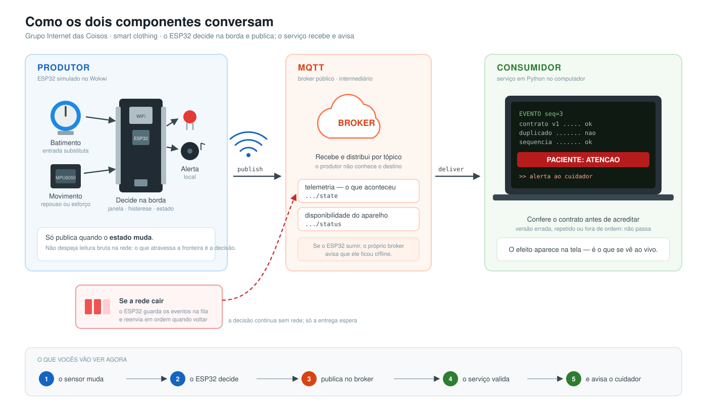
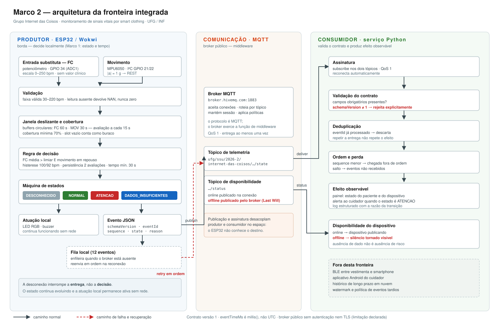

# Marco 2 — Integração produtor / consumidor

**Software para Sistemas Ubíquos — UFG / Instituto de Informática**
Grupo **Internet das Coisos**: Felipe Alves Leão de Araújo, Felipe O Carvalho, Matheus Augusto Ferreira Medeiros, Murilo Bernardo

Projeto: monitoramento de sinais vitais de pessoas em situação de vulnerabilidade física por meio de *smart clothing*.

---

## A fronteira integrada

```
ESP32 / Wokwi  ──MQTT──▶  broker  ──▶  serviço consumidor (Python)
  (produtor)                                (consumidor)
```

O produtor é o protótipo individual do Marco 1 responsável por **estado e processamento temporal**: janela deslizante, cobertura mínima, histerese e persistência. Ele já decidia localmente; agora publica a decisão.

O consumidor valida o contrato, reconhece duplicata e perda pela sequência, e produz efeito observável: painel de estado e alerta ao cuidador.

Não integramos o sistema inteiro. Validamos uma fronteira real entre dois componentes, com uma condição de falha tratada.

---

## Estrutura

```
marco2/
├── produtor/       sketch.ino, diagram.json, libraries.txt
├── consumidor/     consumidor.py, requirements.txt
├── contrato/       evento-v1.json e descrição dos campos
└── docs/           arquitetura-visual.svg, arquitetura.svg, arquitetura.mmd,
                    decisoes.md, comparacao.md,
                    proposta-marco-2.pdf (slides da Aula 05 com o enunciado)
```

---

## Como executar

### 1. Consumidor (primeiro)

```bash
cd consumidor
pip install -r requirements.txt
python consumidor.py
```

Deve aparecer `conectado a broker.hivemq.com` e `aguardando eventos...`.

### 2. Produtor

**Simulação pronta no Wokwi:** https://wokwi.com/projects/476807564770058241 — basta abrir e iniciar a simulação.

Para montar do zero:

1. Abra um projeto ESP32 no Wokwi.
2. Cole `produtor/diagram.json` na aba do diagrama e `produtor/sketch.ino` na aba do código.
3. Adicione as bibliotecas de `produtor/libraries.txt` (PubSubClient, Adafruit MPU6050, Adafruit Unified Sensor, Adafruit BusIO).
4. Inicie a simulação.

O monitor serial deve mostrar `WiFi conectado` e `mqtt: conectado`.

### 3. Provocar a mudança de estado

- MPU6050: X = 0, Y = 0, Z = 1 g (repouso).
- Potenciômetro: acima de 100 bpm.
- Aguarde a janela encher. O consumidor recebe `NORMAL` e depois `ATENCAO`.

> **Tópico compartilhado.** O broker é público, então o prefixo `ufg/ssu/2026-2/internet-das-coisos` identifica o grupo e evita receber publicações de terceiros. Ele precisa ser idêntico em `sketch.ino` e `consumidor.py`.

---

## Condição de falha exercitada

**Broker indisponível.**

Para demonstrar: com a integração funcionando, clique no botão vermelho **"falha broker"** (GPIO 13) no diagrama do Wokwi. A partir daí o produtor trata toda publicação como falha — exatamente o caminho que `publish()` seguiria com o broker fora do ar — até o próximo clique. Em seguida provoque uma transição (por exemplo, suba o potenciômetro acima de 100 bpm para entrar em `ATENCAO`). O monitor serial passa a mostrar:

```
FALHA SIMULADA: broker indisponivel - publicacoes vao para a fila
mqtt: INDISPONIVEL - evento enfileirado (1 na fila)
... mqtt=OFF fila=1
```

O produtor **continua amostrando, avaliando a janela e transitando de estado**. O LED e o buzzer seguem funcionando. O consumidor não recebe nada nesse intervalo. Clique no botão de novo: o produtor esvazia a fila em ordem:

```
falha simulada encerrada - broker disponivel, esvaziando fila
fila: reenviado (0 restantes)
```

No consumidor o evento chega com o `sequence` correto, sem salto. A desconexão interrompe a entrega, não a decisão.

Teclar `f` com o monitor serial em foco faz o mesmo que o botão.

> **Por que a simulação não derruba o socket.** A primeira versão do botão chamava `mqtt.disconnect()`. No Wokwi a reconexão seguinte falhou repetidamente (`rc=-2`, TCP `connect` recusado) e, pior, cada tentativa do `PubSubClient` bloqueou o loop por ~10 s — sem amostra, sem decisão. A simulação agora intercepta no `publish`, que é onde a falha real de rede também aparece para o código; o caminho de reconexão continua existindo para quedas reais (foi ele que reconectou o dispositivo quando o *keepalive* estourava). O bloqueio da reconexão síncrona é uma limitação conhecida da biblioteca; `RETENTATIVA_MQTT_MS` foi elevado a 15 s para que o loop respire entre tentativas.

> Parar o consumidor **não** exercita essa falha: o produtor continua conectado ao broker e publica normalmente; quem perde os eventos é o consumidor, que ao voltar verá um salto na sequência. Isso também é observável, mas é outra condição.

Há ainda um segundo mecanismo: o produtor declara *last will* no tópico `.../status`. Se a simulação for interrompida sem encerramento, o próprio broker publica `offline` (em até 60 s, 1,5× o *keepalive* declarado) e o consumidor mostra que o dispositivo ficou silencioso. Ausência de dado não é ausência de risco.

> **Keepalive no Wokwi.** A simulação com WiFi roda mais devagar que o tempo real, e com o *keepalive* padrão de 15 s o PING chegava atrasado: o broker derrubava a conexão a cada ~25 s e publicava `offline` sem que nada tivesse falhado. O produtor agora declara 40 s ao broker mas pinga a cada 10 s simulados (`MQTT_KEEPALIVE_BROKER_S` / `MQTT_KEEPALIVE_CLIENTE_S`). Se ainda aparecer `offline` espontâneo, é isso, não a fila.

---

## Decisões arquiteturais

Detalhadas em [`docs/decisoes.md`](docs/decisoes.md). Em resumo:

| Decisão | Escolha | Justificativa |
|---|---|---|
| Mecanismo | MQTT | múltiplos consumidores, desacoplamento espacial, dispositivo restrito |
| Contrato | JSON versionado (`schemaVersion`) | permite evoluir sem quebrar o consumidor |
| Identidade | `eventId` + `sequence` | deduplicação e detecção de perda ou inversão |
| Falha | fila local + reenvio em ordem | decisão local sobrevive à perda de rede |
| Silêncio | *last will* MQTT | torna a desconexão observável pelo consumidor |
| QoS | 0 no produtor, 1 no consumidor | evento de transição já tem fila própria e `sequence`; duplicata é tratada pelo `eventId` |

## Arquitetura



Visão detalhada, com as etapas internas de cada componente:



Versão resumida em Mermaid: [`docs/arquitetura.mmd`](docs/arquitetura.mmd).

A comparação entre os protótipos individuais do Marco 1, com o que foi preservado, adaptado e descartado, está em [`docs/comparacao.md`](docs/comparacao.md).

---

## Limitações conhecidas

- `eventTimeMs` é `millis()`, não UTC. Sem relógio sincronizado, não há watermark nem política de eventos tardios.
- A entrada de frequência cardíaca é **substituta** (potenciômetro). Não há aquisição de sinal fisiológico real e nenhuma saída tem valor clínico.
- Broker público, sem autenticação nem TLS. Uma versão real exigiria credenciais, autorização por tópico e canal cifrado.
- BLE, aplicativo Android e histórico em nuvem permanecem fora desta fronteira.
- `mqtt.connect()` do `PubSubClient` é síncrono: com o broker fora do ar, cada tentativa de reconexão bloqueia o loop por até ~10 s. Entre tentativas (15 s) o produtor amostra e decide normalmente. Uma versão real usaria cliente assíncrono ou tarefa separada.

---

## Modo de demonstração

`MODO_DEMO 1` no início do `sketch.ino` reduz a janela para 20 s e o passo de avaliação para 5 s, para caber no tempo da apresentação. `MODO_DEMO 0` restaura os parâmetros da Atividade 02 (60 s e 15 s).

## Onde alterar na verificação

Todos os parâmetros ficam no bloco `1. CONFIGURACAO` do `sketch.ino` e no topo do `consumidor.py`:

| Alteração provável | Onde |
|---|---|
| limiar de entrada / saída em `ATENCAO` | `FC_LIMIAR_ENTRADA`, `FC_LIMIAR_SAIDA` |
| cobertura mínima da janela | `COBERTURA_MINIMA` |
| persistência antes de alertar | `AVALIACOES_PARA_ENTRAR`, `TEMPO_MINIMO_ESTADO_MS` |
| capacidade da fila offline | `FILA_TAMANHO` |
| rejeição por versão do contrato | `SCHEMA_VERSION` (produtor) ≠ `SCHEMA_SUPORTADO` (consumidor) |
| campo obrigatório no consumidor | `CAMPOS_OBRIGATORIOS` |
